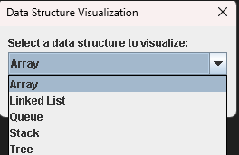
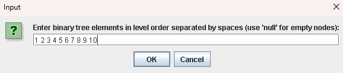
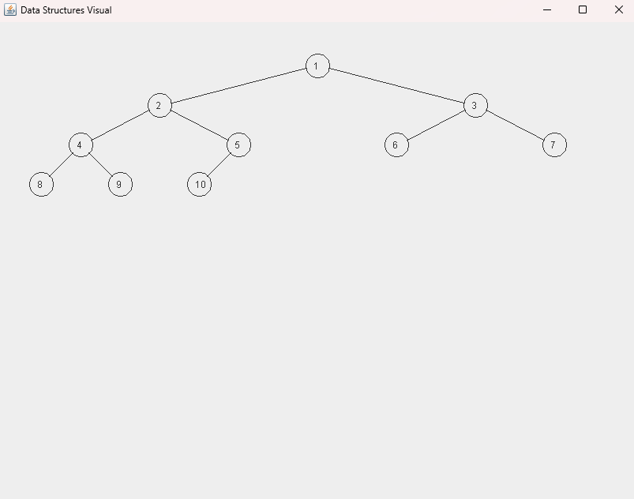

# Data Structures Visualizer

A Java Swing application that visually represents common data structures, including Arrays, Linked Lists, Queues, Stacks, and Binary Trees. Designed as an educational tool to help users better understand how data structures are organized and connected.

## Features
- Visualizes arrays, linked lists, queues, stacks, and binary trees
- Accepts user input to dynamically generate visualizations
- Clear labels for indices, pointers, and structure ends
- Simple, lightweight interface using Java Swing

## How It Works
On launch, the program prompts the user to:
1. Select a data structure to visualize
2. Enter values (space-separated; use `null` for empty tree nodes)

The application then renders the chosen structure with custom-drawn shapes and connectors.

## Screenshots

Launching the application:

Inputting Values for a Tree:

The generated Tree:

## Technologies Used
- Java
- Swing (JFrame, JPanel)
- Custom rendering with `Graphics`

## Author
Zach Kidwell
